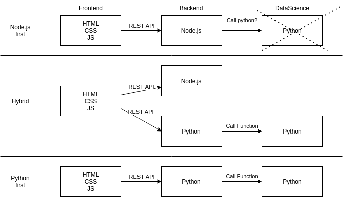

# Web Development meets Data Science - Data Science & Backend Workshop

Getting started with Github Codespaces or Gitpod  
[](https://gitpod.io/#https://github.com/NJannasch/techlabs-dortmund-wd-dsai)

## Description
This repository contains the materials used in the TechLabs workshop 'Data Science & Backend Workshop'.
It gives an overview on how Web Development can be combined with Data Science.

Therefore the following topics are covered:

| Recommended for tracks | Technologies | Note |
| - | - | - |
| Web Development | HTML, JavaScript, CSS, NodeJS | Web only project |
| Web Development & DS/AI | HTML, JavaScript, CSS, NodeJs and/or **Python** | Web & DS/AI project |
| DS/AI | Python (and minor HTML & CSS) | DS/AI project |



### Web Development
Technologies:
- HTML, CSS, JavaScript & NodeJS

Frontend:  
The frontend can be either created in plain HTML, CSS and JavaScript or a framework like React, Angular or Svelte could be used.

Backend:  
For the backend a framework like Express.js is recommended as described in the web development track.

Communication between frontend and backend:  
REST API, GraphQL, WebSocket or [HTTP/2](https://www.infoq.com/articles/websocket-and-http2-coexist/)

### Web Development & Data Science / Artificial Intelligence
Technologies:
- HTML, CSS, JavaScript, NodeJS
- Python

Frontend:
The frontend can be either created in plain HTML, CSS and JavaScript or a framework like React, Angular or Svelte could be used.  
Plotly can be used for interactive charts and graphs.

Backend:  
For the backend a Python based framework like FastAPI is recommended.

Communication between frontend and backend:  
REST API

### Data Science / Artificial Intelligence
Technologies:
- Python

Frontend:  
CSS only for tuning the UI

Backend:  
Use a framework like dash or streamlit 

Communication between frontend and backend:  
Handled automatically by the framework


### Project structure
```bash
demo
├── dash
├── express-js
├── fastapi
│   └── frontend
└── streamlit
```


## Appendix
- Python
  - Web Framework [FastAPI](https://fastapi.tiangolo.com/)
  - Graphing Library [Plotly](https://plotly.com/graphing-libraries/)
  - Framework for building ML & data science web apps [Dash](https://dash.plotly.com/)
  - Framework for build and share data apps [Streamlit](https://streamlit.io/)
- JavaScript
  - Web Framework [Express](https://expressjs.com/)
  - Graphing Library [Plotly](https://plotly.com/graphing-libraries/)
  - HTTP client for brownser and node.js [Axios](https://axios-http.com/)

Additional readings:
- [Streamlit vs. Dash vs. Shiny vs. Voila vs. Flask vs. Jupyter](https://www.datarevenue.com/en-blog/data-dashboarding-streamlit-vs-dash-vs-shiny-vs-voila)


Nice tutorials:
- Official tutorial [FastAPI](https://fastapi.tiangolo.com/tutorial/)
- [FastAPI Realpython](https://realpython.com/fastapi-python-web-apis/)